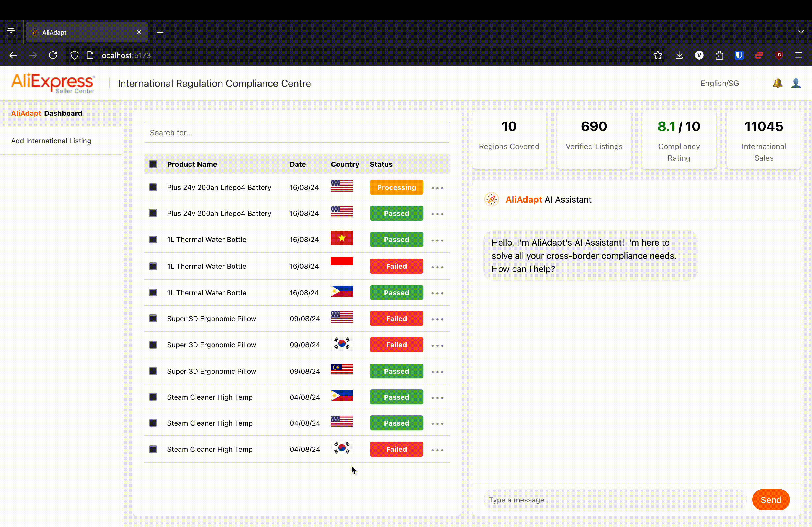

# AliAdapt (emoji)
## Creators

[Joel Lim](https://www.linkedin.com/in/limjingkaijoel/): Sourcing state-of-the-art machine learning models and finetuning them.

[Vince Tan](https://linkedin.com/in/vincetanyuehyang/): User interface and web app.

[Zane Chee](https://linkedin.com/in/zanechee/): Business value proposition, slide decks, and pitch.

## AliAdapt AI Models

This project is a comprehensive system designed to verify whether a product can be exported into a specific region without additional permits. If it can, a verification checkmark will be given for the seller to export their product into the desired country. If not, a retrieval augmented chatbot will aid them in obtaining the necessary permits and licenses to do so.

The system comprises three main components:

### **1. Product Attribute Extraction**: 
This component uses a state-of-the-art Large Language Model (LLM) based on GPT-4o mini to extract key attributes from product descriptions. Recent research indicates that LLMs have surpassed traditional Named Entity Recognition (NER) methods in accurately identifying and extracting relevant attributes from text.

### **2. Product Classification Model**: 
A fine-tuned BERT model is used to classify whether a product is eligible for export into the target region without additional permits.

Women's winter padded jacket: Pass!

Electric personal mobility device: Fail... (Singapore has strict regulations for these! A permit is required.)

### **3. Retrieval-Augmented Language Model Chatbot**: 
If a product is found ineligible for export, the system redirects to a chatbot that provides guidance on obtaining the necessary permits based on regulatory compliance rules.

## Additional Screens

Our AliAdapt Dashboard, with all the seller's listings and their statuses for export clearly shown at a glance.

Our listing screen where sellers can input their product descriptions and URL, and get an AliAdapt verification checkmark if their item is ready for export.

## Notes

**Data Limitations**: Currently, the chatbot only contains only limited regulatory data. Additional data is required for other countries, which can be added by expanding the dataset and generating new embeddings. The reason why we chose to stick with only a small dataset for our project is because embedding a larger dataset and retrieving embeddings from a large vector space can require lots of computing power, which we do not have as students preparing for a demo in a short timeframe.

**Model Training**: The BERT model and tokenizer must be fine-tuned before running the classification script. Using the script in the resources folder, the appropriate folders to store the model and tokenizer will be generated, after which the classification model can be run.

## Future Improvements

**Expand Regulatory Data**: Add more countries and regulatory data to the database for broader applicability, if we have the resources to do so, in terms of time, data, and computing power.

**Create Other Modules**: Create modules for other regions that have AliExpress in their country, so that we can generalise the model to help with compliance regulations across the globe.

## Literature References
- Brinkman, J. **"Product Attribute Value Extraction using Large Language Models."** 2023. Available at: [arXiv:2310.12537](https://arxiv.org/abs/2310.12537).

- Chen, W.-T., Shinzato, K., Yoshinaga, N., & Xia, Y. **"Does Named Entity Recognition Truly Not Scale up to Real-world Product Attribute Extraction?"** 2022. In *Proceedings of the 2022 Conference on Empirical Methods in Natural Language Processing (EMNLP)*, pp. 1234-1245. Available at: [DOI:10.18653/v1/2023.emnlp-industry.16](https://aclanthology.org/2023.emnlp-industry.16/).

- Jamshidi, S., Mohammadi, M., Bagheri, S., Najafabadi, H. E., Rezvanian, A., Gheisari, M., Ghaderzadeh, M., Shahabi, A. S., & Wu, Z. **"Effective Text Classification using BERT, MTM LSTM, and DT."** 2023. *Journal of Machine Learning Research*, 24(103), 1-25. Available at: [DOI:10.1016/j.datak.2024.102306]

- Kamath, U., Keenan, K., Somers, G., & Sorenson, S. (2024). **"Retrieval-Augmented Generation."** In *Large Language Models: A Deep Dive*, Springer, Cham.

## License

This project is licensed under the MIT License. See the `LICENSE` file for more details.